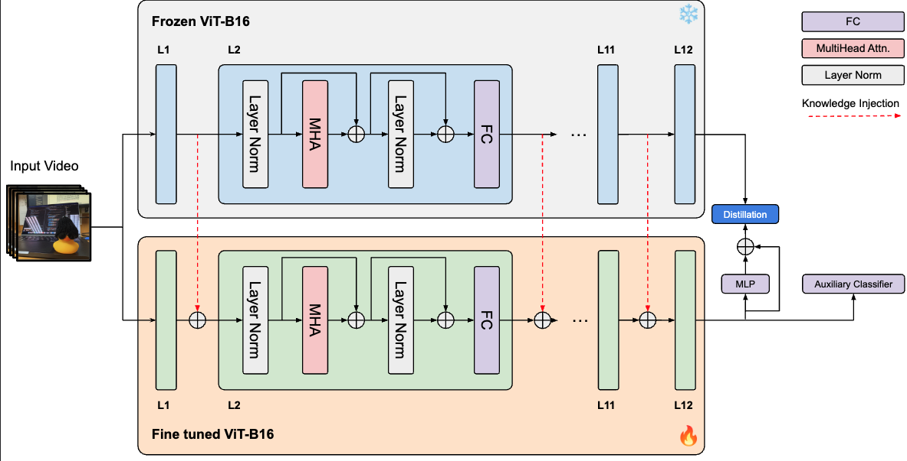

# KICLIP: Knowledge Injection Improves Distillation

<!-- pdf based image -->



## How to Use

<p style="font-weight:bold; color:red">First clone this repository</p>
<p style="font-weight:bold; color:red">Then enter the directory of this repo in your terminal</p>

## Dependencies

```bash
pip install scipy
pip install pandas
pip install scikit-learn
pip install ftfy
pip install regex
```

```bash
pip install 'git+https://github.com/facebookresearch/fvcore'
pip install simplejson
conda install av -c conda-forge
pip install -U iopath
pip install psutil
pip install opencv-python
pip install tensorboard
git clone https://github.com/facebookresearch/pytorchvideo.git
cd pytorchvideo
pip install -e .
git clone https://github.com/facebookresearch/detectron2 detectron2_repo
pip install -e detectron2_repo
```

## Data Preparation

- **Kinetics-400.**

  We obtained the compressed version Kinetics-400 dataset, where videos have been resized to 256, from the [`VoV3d Repo`](https://github.com/youngwanLEE/VoV3D/blob/main/DATA.md#kinetics-400). The repository provides the download link for the dataset: [`Kinetics-400 dataset link`](https://dl.dropbox.com/s/419u0zljf2brsbt/compress.tar.gz). After downloading and extracting the data, you should rename the folders "train_256" and "val_256" to "train" and "val" respectively. Additionally, please note that the video "val/crossing_river/ZVdAl-yh9m0.mp4" is invalid and needs to be replaced. You should download a new version of the video from [`here`](https://drive.google.com/file/d/15M07kKQlZEoVzUezppITSnICs83fch8A/view?usp=share_link) and perform the replacement.

- **UCF-101.**

  We download UCF-101 dataset by the [`script`](https://github.com/open-mmlab/mmaction2/blob/main/tools/data/ucf101/download_videos.sh) provided by MMAction2.

- **HMDB-51.**

  We download the HMDB-51 dataset by the [`script`](https://github.com/open-mmlab/mmaction2/blob/main/tools/data/hmdb51/download_videos.sh) provided by MMAction2.

- **Kinetics-600 testing.**

  The validation data of Kinetics-600 we used can be downloaded from [`link`](https://pan.baidu.com/s/1d6wI-n3igMdE1rJ2xP2MsA?pwd=c5mu).

The data should be in the following structure:

```bash
ROOT PROJECT DIRECTORY
- data
    - k400
        - train
        - val
        - test
    - ucf101
    - hmdb51
        - videos
    - kinetics-600
        - val
```

## Training

<p style="font-weight:bold; color:red">The following scripts can be used for training for the base to novel setting.</p>
<p style="font-weight:bold; color:red">Please inspect the scripts to change the paths according to the arrangements on your system.</p>

#### Base To Novel Setting

1. `bash train_b2n_hmdb51.sh`
2. `bash train_b2n_ucf101.sh`
3. `bash train_b2n_k400.sh`

#### Cross Dataset Setting

1. `bash train_cd_k400.sh`

## Evaluation

You need to use the weight average tool. Make sure to change the directories according to the experiment in the weight_average_tool.py file. Then run:
`python weight_average_tool.py`

#### Base To Novel Setting

Run the test scripts. Make sure to change the directories according to the experiment in the test scripts.

`bash test_b2n_hmdb51.sh`
`bash test_b2n_ucf101.sh`
`bash test_b2n_k400.sh`

#### Cross Dataset Setting

TBA
